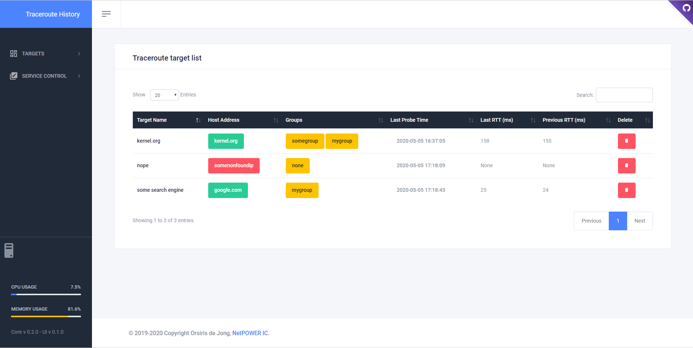

# Traceroute History

Traceroute History is under heavy developpment (see TODO.TXT).

Traceroute History records Unix traceroute & Windows tracert outputs to a database, upon host changes in hops, or big rtt increases to hops.
The core can be run as a service or as a cron task, both providing regular probe updates.
It can be run via cron / task scheduler or as service.

## Setup

0. Install development tools via `dnf install python3-devel gcc make`
1. Install requirements via `pip -m install -r requirements.txt` and `pip -m install -r requirements-python36.txt` if you run with Python 3.6
1. Adjust the configuration file `traceroute_history.conf` according to your needs.
2. Initialize the database
   `traceroute_history.py --config=traceroute_history.conf --init-db`
3. Run as cron task with `traceroute_history.py --config=traceroute_history.conf --update-now`
   
   Example of a cron entry in /etc/crontab
   
   `30 * * * * root /usr/bin/python3 /opt/traceroute_history/traceroute_history.py --config=/opt/traceroute_history/traceroute_history.conf --update-now`
   
   or run as service
   `traceroute_history.py --config=traceroute_history.conf --daemon`

## User interface

There's currently a CLI and a GUI interface available.
CLI can be executed directly via the script, eg:

`traceroute_history.py --help`

GUI relies on FastAPI and uvicorn modules.
GUI can be launched via `user_interface.py` and will by default listen on 127.0.0.1:5001


   
## Smokeping integration

Traceroute History can directly read smokeping configuration files in order to add them as probe targets.
It also provides a FastCGI script that can be directly integrated into smokeping:

In your smokeping virtualhost add

```
<Directory "/path/to/traceroute_history">
    require all granted
</Directory>

Alias /smokeping_th_helper.fcgi /path/to/traceroute_history/smokeping_th_helper.fgci
```

In your smokeping basepage.html file (generally in /opt/smokeping/etc), add the `smokeping_th_helper.js` script after the other scripts.
Your source should look like: 
```
<script src="js/prototype.js" type="text/javascript"></script>
<script src="js/scriptaculous/scriptaculous.js?load=builder,effects,dragdrop" type="text/javascript"></script>
<script src="js/cropper/cropper.js" type="text/javascript"></script>
<script src="js/smokeping.js" type="text/javascript"></script>
// Added script
<script src="js/smokeping_th_helper.js" type="text/javascript"></script>
```

Also copy `smokeping_th_helper.js` to your `www/js` folder.

